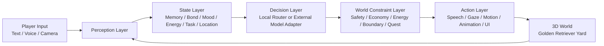

# Golden Twin

Golden Twin is a browser-based demo for an embodied AI golden retriever.
It is not a static 3D pet viewer and not a literal biological simulation.
It is a product prototype for an interactive AI character game where a dog can:

- perceive player input from text, voice, and camera
- maintain internal state such as memory, bond, mood, energy, and task progress
- route decisions through a layered "brain" instead of a single prompt
- express decisions through speech, gaze, motion, posture, and simple gameplay actions
- stay inside explicit world rules so the character does not break safety, story, or economy constraints

The current demo uses a golden retriever in a fenced yard, but the same architecture can be extended to other animals, stylized characters, or humanoid companions.

## Product Summary

Golden Twin explores a commercial game direction: embodied AI characters with persistent memory and real-time interaction.
The goal is to turn a language model from a chat box into a character with a body, a place, a relationship, and rules.

The core product idea is:

1. the player interacts with a living character, not a menu
2. the character has a readable internal state, not random output
3. the character acts inside a designed game world, not an unconstrained sandbox
4. the AI stack is model-agnostic, so different providers can power different parts of the system

## Product Goals

- Build a believable AI dog companion that feels embodied instead of text-only.
- Demonstrate a five-layer runtime architecture that can scale beyond a single demo.
- Show how to combine realtime interaction with rules, memory, and economy constraints.
- Provide a practical foundation for a future commercial game or AI pet platform.

## Experience Design

The intended player experience is simple:

- talk to the dog
- show the dog your environment
- issue play, care, training, or bonding cues
- watch the dog react through body language and motion
- progress a lightweight relationship and quest loop over time

This keeps the demo legible while proving the core loop of an embodied AI companion.

## Core Features

### Perception Layer

- Text input from the player
- Voice input through the Web Speech API
- Camera input through `getUserMedia`
- Lightweight visual summarization based on motion, brightness, and dominant color

### State Layer

- Persistent memory stored in `localStorage`
- Relationship state through a bond meter
- Emotional and gameplay state through joy, focus, energy, and mood
- Resource state through treats and coins
- Session context through location, current action, and active task

### Decision Layer

- Local multi-route decision engine for demo reliability
- Specialized routes for care, play, training, observation, rest, bonding, and safety
- Optional OpenAI-compatible adapter slot for external model routing
- Explicit planner output, not only conversational output

### Action Layer

- Dog reply text
- Browser speech synthesis
- Head tracking and gaze shifts
- Tail wagging and idle motion
- Sit, rest, bowl walk, fetch, return, and guard-like posture changes

### World Constraint Layer

- Yard boundary as a spatial rule
- Safety filtering for harmful requests
- Economy limits for treats and rewards
- Energy gating for physically expensive actions
- Quest progression tied to actual interactions

## Product Principles

The demo is built around a few product and engineering principles:

### 1. Embodiment over pure chat

The AI should not only generate words.
It should produce visible intent through posture, gaze, and movement.

### 2. State over improvisation

A character becomes believable when it has continuity.
Memory, relationship, energy, and context matter more than fluent text alone.

### 3. Constraints over unrestricted generation

A commercial game cannot let the model invent new rules every turn.
Safety, economy, task logic, and space boundaries must remain external and enforceable.

### 4. Routing over single-model dependence

Different model providers are good at different things.
Realtime dialogue, planning, memory compression, and moderation should be separable concerns.

### 5. Product legibility over technical magic

The player should understand why the dog acts a certain way.
That is why the UI exposes route selection, planner notes, status meters, quest progress, and memory.

## How It Works

At runtime, Golden Twin forms a closed loop:

1. collect player input from text, voice, or camera
2. translate those signals into structured perception updates
3. merge perception with memory and gameplay state
4. route the request through a decision engine
5. apply rule checks and world constraints
6. map the approved decision into 3D motion, voice, UI updates, and memory entries
7. persist the resulting state for the next turn

This loop is the key product idea.
The model is only one part of the character.
The character is the full loop.

## System Architecture



### Layer Responsibilities

| Layer | Responsibility | Current Demo Implementation |
| --- | --- | --- |
| Perception | Convert player signals into structured observations | Text input, voice recognition, webcam analysis |
| State | Maintain continuity across turns | `localStorage` memory, meters, quest progress |
| Decision | Interpret intent and choose a plan | Local route engine plus optional OpenAI-compatible adapter |
| Constraints | Keep behavior safe and game-consistent | Safety guardrails, energy checks, treat inventory, quest rules |
| Action | Turn plans into visible behavior | Speech synthesis, head tracking, pose changes, movement cues |

## Technical Architecture

### Frontend

- `index.html`
  - app shell and UI layout
- `styles.css`
  - visual system, responsive layout, and panel styling
- `src/scene.js`
  - three.js scene, dog model, environment, and animation logic
- `src/main.js`
  - app bootstrap, event wiring, voice/camera integration, and runtime loop
- `src/state.js`
  - persistent state store and memory handling
- `src/brain.js`
  - intent classification, route selection, model adapter, and world governor

### AI Runtime Pattern

The current demo uses a local deterministic decision layer first.
That is deliberate.
For a product prototype, it is more important to validate interaction design than to depend on a remote model for every turn.

The external model adapter exists for future routing, but the production pattern should be:

- low-latency reactions handled locally or by a realtime model
- slower planning delegated to a stronger remote model
- safety and economy rules enforced outside the model
- memory summarized and compacted instead of dumping full history into every request

## Why This Architecture Matters

A commercial embodied AI game has very different requirements from a chatbot:

- response time must feel immediate
- outputs must remain in character
- actions must respect the game world
- behavior must be testable and debuggable
- costs must stay bounded as interaction frequency grows

This repository demonstrates the minimum architecture that addresses those constraints without requiring a full backend yet.

## Current Demo Scope

The current version is intentionally narrow:

- one character: a golden retriever
- one environment: a fenced yard
- one lightweight quest: trust-building through praise and training
- one simple economy: treats and coins
- one local 3D scene with expressive but simple animation

That narrow scope is useful because it proves the loop before expanding content.

## Productization Path

The likely product path is not "one giant model controls everything."
A more realistic commercial roadmap is:

### Phase 0: Prototype

- prove the embodied interaction loop
- test whether players understand the character state
- validate that motion and dialogue feel linked

### Phase 1: Playable AI Companion

- add multiple scenes such as yard, living room, and park
- add user profiles and persistent save slots
- add a backend proxy for model providers
- add better memory compression and analytics

### Phase 2: Commercial Game Layer

- add progression systems, collectibles, training tracks, and cosmetics
- add scene unlocks and longer quest arcs
- add content authoring tools for designers
- add moderation, telemetry, and replay tooling

### Phase 3: Multi-Character Platform

- support multiple animals or character archetypes
- support shared memory across scenes
- support provider routing by task and cost tier
- support live operations, seasonal content, and A/B testing

## Commercial Potential

This architecture can support several product directions:

- AI pet companion game
- family-friendly animal care and training game
- social digital pet platform
- premium AI character experience with progression and personalization
- white-label embodied character platform for branded characters

The commercial value comes from continuity, attachment, and repeat interaction, not only from novelty.

## Risks and Limitations

- Browser voice APIs are inconsistent across browsers.
- Webcam analysis is heuristic and not semantic image understanding.
- The external provider mode is a placeholder and should not expose real API keys directly from the browser.
- The current 3D dog is procedural and stylized, not production-quality character art.
- Memory is session-local in browser storage, not user-account based.

## Run Locally

Because this app uses browser modules and device APIs, it should be run over a local HTTP server rather than opened directly as a `file://` page.

```bash
cd /Users/kingla/Cowork/Kingla/Twin
python3 -m http.server 4173
```

Then open:

- [http://localhost:4173](http://localhost:4173)

## Near-Term Development Plan

The next practical steps are:

1. add a backend proxy for real model providers and tool routing
2. replace heuristic vision with real image understanding
3. expand the dog state model into schedules, habits, and longer memory
4. upgrade animation from pose switching to a richer state machine
5. add more environments, missions, and progression systems
6. introduce account-based persistence and cloud saves

## Long-Term Direction

Golden Twin is a demo for a broader idea:
an AI-native game character should be designed as a full embodied system, not as a language model pasted onto a 3D mesh.

If this direction continues, the next major milestone is to evolve from "interactive demo" into "playable AI companion game" with a backend, real content pipeline, stronger moderation, and measurable retention loops.
